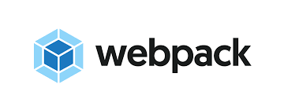

# BestBuy Searchbar Clone
<h1>Access the Demo</h1>

<!-- Click here to acess the demo ==> https://richigro.github.io/Fake-User-Generator/ -->

<h2>What the app does</h2>

The app was created with the intention of reacreating the functionality of the searchbar inside the <a href="https://www.bestbuy.com/">Real BestBuy app</a>. It contains most of the functionality of the real app, it includes predictive text, that swifts trough all possible items in the store to find an item that matches the user's search.

<h3>Why I created this app</h3>

This particular app was created in an team effort to recreate a popular site's frontend while using a microservices type architecture.My team consisted of 4 team member, we separated the responsibilities into 4 main basic components. The search-bar(this app), the product image, the carousel and reviews.Each componet was created separetly from each other's.Each of our components can run individually, but also have the ability to talk to each other trough a proxy server that each of us also deployed on Aws(elastic beanstalk).

<h2>Important Notice</h2>

All of the data that this application uses was obtained using a BestBuy developer's Api Key (Not included), which is no longer active meaning the data is hard-coded.

<h2> How to Use </h2>

Using this searchbar is the easiest thing you'll ever do. Which is why you can see all of its functionality in 5 easy steps.

<h2>Demo</h2>

<h2>Technologies</h2>
  
  
  
  
  
  
  <h3>Frontend</h3>
    React with hooks
    Html
    Css
    Webpack & babel-loader (no create-react-app boiler)
  <h3>Backend</h3>
  Nodejs
  Express
  AWS Elastic Beanstalk
  AWS S3
  AWS RDS
